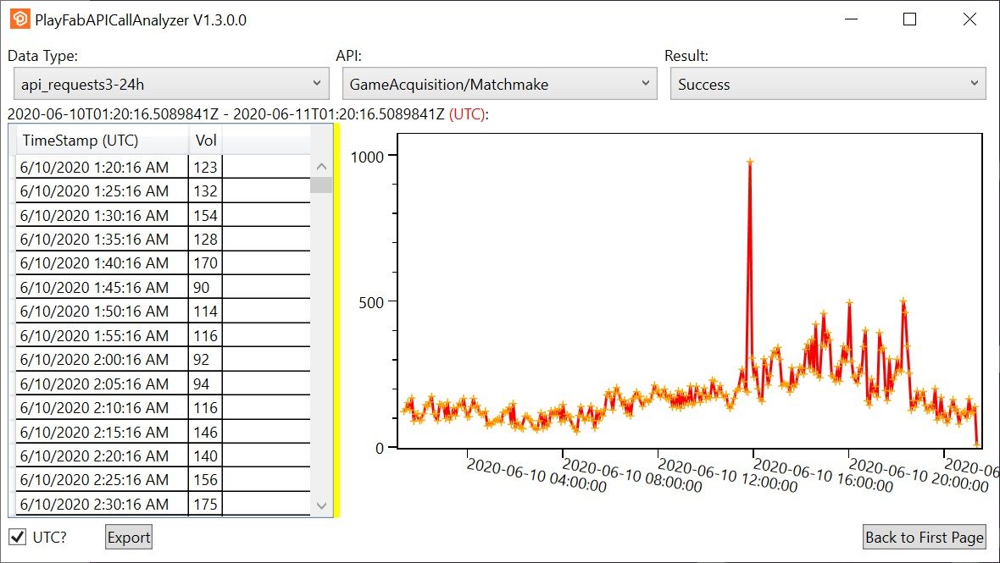

# PlayFabAPICallAnalyzer

PlayFab API Call Analyzer is a tool to analysis the PlayFab API call raw data presented in normal GM dashboard.

The goal of the project is to improve the efficiency and accuracy of analyzing the problems such as request frequency and exceptions.

The supported feature:
1. Two breakdown views: API->Result and Result->API
2. Raw data visualization- table and chart
3. Raw data export - Excel as target

